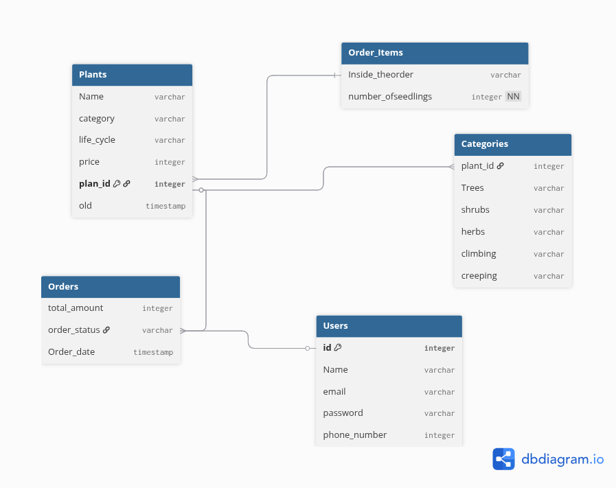

# 🌱 Plant Management Project

## Welcome! 👋
Hi! This is a small web app I made for people who love plants. It’s like having a little garden online. You can add your plants, see them, and manage them easily.  

## What You Can Do
- **Sign Up & Log In:** Make your own account and keep your plants safe.  
- **Add Plants:** Give a name, price, life cycle, and even a picture.  
- **See Plants:** Look at all the plants other users added.  
- **Plant Details:** Click any plant to see more information.  
- **Edit & Delete:** Change the details or remove a plant when needed.  

## Why This App
I wanted a simple way for plant lovers to organize their plants online. It is easy to use and lets you share your plants with others.  

## Technology Used
- **Backend:** Django  
- **Frontend:** HTML & CSS  
- **Database:** SQLite  
- **Images:** You can upload pictures for your plants 🌿  

## ERD

Table Plants {
  Name varchar
  category varchar
  life_cycle varchar
  price integer
  plan_id integer [primary key]
  old timestamp
}

Table Users {
  id integer [primary key]
  Name varchar
  email varchar
  password varchar
 phone_number integer
}

Table Orders {
  total_amount integer 
  order_status varchar
  Order_date timestamp
}

Table Order_Items {
  Inside_theorder varchar
  number_ofseedlings integer [not null]
}
Table Categories {
plant_id integer [unique]  
 Trees varchar
  shrubs varchar
  herbs varchar
  climbing varchar
  creeping varchar
}
REF: Plants.plan_id < Categories.plant_id
REF: Users.id < Orders.order_status
REF: Orders.order_status > Plants.plan_id
REF: Plants.plan_id > Order_Items.Inside_theorder

